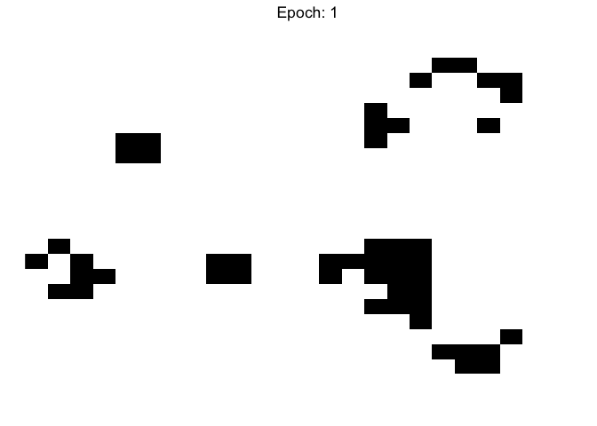
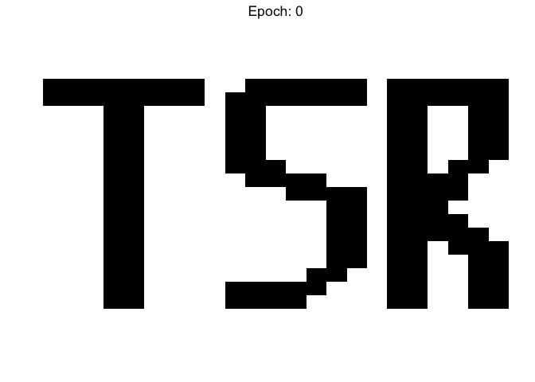

# Game of Life



This is an R implementation of John Conway’s Game of Life (GoL)
simulation.

The game is played on a two-dimensional matrix where every cell is
either ‘alive’ or ‘dead’. During each round of the game (epoch), the
following rules are applied simultaneously to each cell:

1.  If a cell is ‘alive’ and surrounded (horizontally, vertically, or
    diagonally) by 2 or 3 live cells, then it survives into the next
    epoch
2.  If a cell is currently ‘dead’ but surrounded by 2 live cells, then
    it becomes alive in the next epoch
3.  Otherwise, cells become/remain dead

The game must be seeded by presenting a starting array of dead and alive
cells. For example, we can load my initials as a series of live cells
into a \(25 \times 25\) grid, convert to a matrix, then plot (black
squares indicate alive cells):

``` r
seeding <- read_csv("gol_tsr.csv", col_names = FALSE)
```

    ## 
    ## ── Column specification ────────────────────────────────────────────────────────
    ## cols(
    ##   .default = col_double()
    ## )
    ## ℹ Use `spec()` for the full column specifications.

``` r
# Remove names 
names(seeding) <- NULL
rownames(seeding) <- NULL
board_seeded <- as.matrix(seeding)

# Plot initial game board
plot_board(board_seeded)
```

<!-- -->

## Running GoL

The mechanics behind this implementation of the GoL can be found in
`functions.R`.

Here, we simply run the game for 150 epochs (i.e. 150 successive
applications of the rules listed above). The `run_game` function returns
a list of the board states after each epoch. The `animate_game` function
converts and saves this list of matrices as a gif.

    ## Epoch:  2  |   > ( 1 %)Epoch:  3  |   > ( 2 %)Epoch:  4  |   > ( 3 %)Epoch:  5  |   > ( 3 %)Epoch:  6  |   > ( 4 %)Epoch:  7  |   > ( 5 %)Epoch:  8  |   > ( 5 %)Epoch:  9  |   > ( 6 %)Epoch:  10  |   > ( 7 %)Epoch:  11  |   > ( 7 %)Epoch:  12  |   > ( 8 %)Epoch:  13  |   > ( 9 %)Epoch:  14  |   > ( 9 %)Epoch:  15  |   > ( 10 %)Epoch:  16  |  = > ( 11 %)Epoch:  17  |  = > ( 11 %)Epoch:  18  |  = > ( 12 %)Epoch:  19  |  = > ( 13 %)Epoch:  20  |  = > ( 13 %)Epoch:  21  |  = > ( 14 %)Epoch:  22  |  = > ( 15 %)Epoch:  23  |  = > ( 15 %)Epoch:  24  |  = > ( 16 %)Epoch:  25  |  = > ( 17 %)Epoch:  26  |  = > ( 17 %)Epoch:  27  |  = > ( 18 %)Epoch:  28  |  = > ( 19 %)Epoch:  29  |  = > ( 19 %)Epoch:  30  |  = > ( 20 %)Epoch:  31  |  == > ( 21 %)Epoch:  32  |  == > ( 21 %)Epoch:  33  |  == > ( 22 %)Epoch:  34  |  == > ( 23 %)Epoch:  35  |  == > ( 23 %)Epoch:  36  |  == > ( 24 %)Epoch:  37  |  == > ( 25 %)Epoch:  38  |  == > ( 25 %)Epoch:  39  |  == > ( 26 %)Epoch:  40  |  == > ( 27 %)Epoch:  41  |  == > ( 27 %)Epoch:  42  |  == > ( 28 %)Epoch:  43  |  == > ( 29 %)Epoch:  44  |  == > ( 29 %)Epoch:  45  |  == > ( 30 %)Epoch:  46  |  === > ( 31 %)Epoch:  47  |  === > ( 31 %)Epoch:  48  |  === > ( 32 %)Epoch:  49  |  === > ( 33 %)Epoch:  50  |  === > ( 33 %)Epoch:  51  |  === > ( 34 %)Epoch:  52  |  === > ( 35 %)Epoch:  53  |  === > ( 35 %)Epoch:  54  |  === > ( 36 %)Epoch:  55  |  === > ( 37 %)Epoch:  56  |  === > ( 37 %)Epoch:  57  |  === > ( 38 %)Epoch:  58  |  === > ( 39 %)Epoch:  59  |  === > ( 39 %)Epoch:  60  |  === > ( 40 %)Epoch:  61  |  ==== > ( 41 %)Epoch:  62  |  ==== > ( 41 %)Epoch:  63  |  ==== > ( 42 %)Epoch:  64  |  ==== > ( 43 %)Epoch:  65  |  ==== > ( 43 %)Epoch:  66  |  ==== > ( 44 %)Epoch:  67  |  ==== > ( 45 %)Epoch:  68  |  ==== > ( 45 %)Epoch:  69  |  ==== > ( 46 %)Epoch:  70  |  ==== > ( 47 %)Epoch:  71  |  ==== > ( 47 %)Epoch:  72  |  ==== > ( 48 %)Epoch:  73  |  ==== > ( 49 %)Epoch:  74  |  ==== > ( 49 %)Epoch:  75  |  ==== > ( 50 %)Epoch:  76  |  ===== > ( 51 %)Epoch:  77  |  ===== > ( 51 %)Epoch:  78  |  ===== > ( 52 %)Epoch:  79  |  ===== > ( 53 %)Epoch:  80  |  ===== > ( 53 %)Epoch:  81  |  ===== > ( 54 %)Epoch:  82  |  ===== > ( 55 %)Epoch:  83  |  ===== > ( 55 %)Epoch:  84  |  ===== > ( 56 %)Epoch:  85  |  ===== > ( 57 %)Epoch:  86  |  ===== > ( 57 %)Epoch:  87  |  ===== > ( 58 %)Epoch:  88  |  ===== > ( 59 %)Epoch:  89  |  ===== > ( 59 %)Epoch:  90  |  ===== > ( 60 %)Epoch:  91  |  ====== > ( 61 %)Epoch:  92  |  ====== > ( 61 %)Epoch:  93  |  ====== > ( 62 %)Epoch:  94  |  ====== > ( 63 %)Epoch:  95  |  ====== > ( 63 %)Epoch:  96  |  ====== > ( 64 %)Epoch:  97  |  ====== > ( 65 %)Epoch:  98  |  ====== > ( 65 %)Epoch:  99  |  ====== > ( 66 %)Epoch:  100  |  ====== > ( 67 %)Epoch:  101  |  ====== > ( 67 %)Epoch:  102  |  ====== > ( 68 %)Epoch:  103  |  ====== > ( 69 %)Epoch:  104  |  ====== > ( 69 %)Epoch:  105  |  ====== > ( 70 %)Epoch:  106  |  ======= > ( 71 %)Epoch:  107  |  ======= > ( 71 %)Epoch:  108  |  ======= > ( 72 %)Epoch:  109  |  ======= > ( 73 %)Epoch:  110  |  ======= > ( 73 %)Epoch:  111  |  ======= > ( 74 %)Epoch:  112  |  ======= > ( 75 %)Epoch:  113  |  ======= > ( 75 %)Epoch:  114  |  ======= > ( 76 %)Epoch:  115  |  ======= > ( 77 %)Epoch:  116  |  ======= > ( 77 %)Epoch:  117  |  ======= > ( 78 %)Epoch:  118  |  ======= > ( 79 %)Epoch:  119  |  ======= > ( 79 %)Epoch:  120  |  ======= > ( 80 %)Epoch:  121  |  ======== > ( 81 %)Epoch:  122  |  ======== > ( 81 %)Epoch:  123  |  ======== > ( 82 %)Epoch:  124  |  ======== > ( 83 %)Epoch:  125  |  ======== > ( 83 %)Epoch:  126  |  ======== > ( 84 %)Epoch:  127  |  ======== > ( 85 %)Epoch:  128  |  ======== > ( 85 %)Epoch:  129  |  ======== > ( 86 %)Epoch:  130  |  ======== > ( 87 %)Epoch:  131  |  ======== > ( 87 %)Epoch:  132  |  ======== > ( 88 %)Epoch:  133  |  ======== > ( 89 %)Epoch:  134  |  ======== > ( 89 %)Epoch:  135  |  ======== > ( 90 %)Epoch:  136  |  ========= > ( 91 %)Epoch:  137  |  ========= > ( 91 %)Epoch:  138  |  ========= > ( 92 %)Epoch:  139  |  ========= > ( 93 %)Epoch:  140  |  ========= > ( 93 %)Epoch:  141  |  ========= > ( 94 %)Epoch:  142  |  ========= > ( 95 %)Epoch:  143  |  ========= > ( 95 %)Epoch:  144  |  ========= > ( 96 %)Epoch:  145  |  ========= > ( 97 %)Epoch:  146  |  ========= > ( 97 %)Epoch:  147  |  ========= > ( 98 %)Epoch:  148  |  ========= > ( 99 %)Epoch:  149  |  ========= > ( 99 %)Epoch:  150  |  ========= > ( 100 %)
    ##  End of game!

And here’s the full result:


